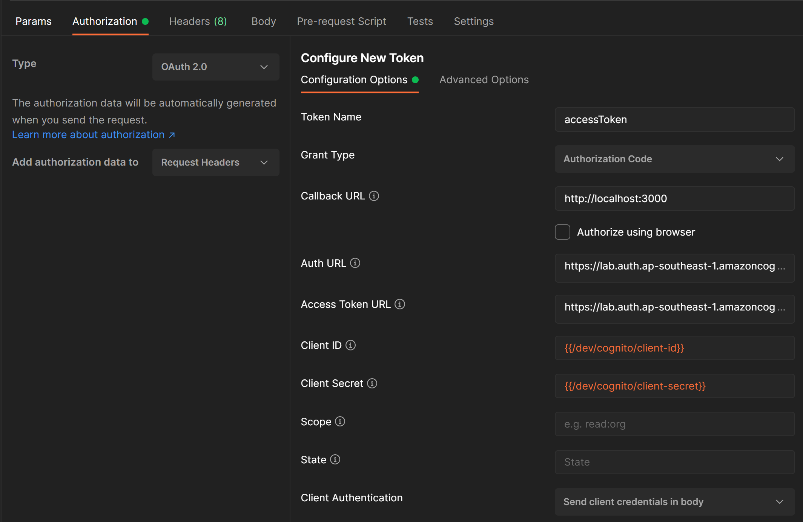

*If you would like to support these tutorials, you can contribute to my [Patreon account](https://patreon.com/czetsuya)

# AWS Cognito Integration with Spring Security

## Introduction

This Spring Boot project demonstrates web and method security using 

## How to Use

### Maven Dependency

This library is released on Central, make sure to get the latest version.

```
<dependency>
  <groupId>com.czetsuyatech</groupId>
  <artifactId>ct-services-jwt-security</artifactId>
  <version>${ct.services.jwt.security.version}</version>
</dependency>
```

### Security Configuration Data

We need to define the following Spring application configs to connect to our AWS Cognito instance to decode and verify
the JWT token.

```
app:
  security:
    jwt:
      cognito:
        group-field: cognito:groups
        user-name-field: username
        pool-id: ${AWS_COGNITO_POOL_ID}
        region: ${AWS_COGNITO_REGION}
```

### Enabling Web and Method Security

To enable the web and method security in your microservice. Create a new Java class CtAppSecurityConfiguration and
annotate it with EnableCtSecurity. In this class we define the custom beans that generates the HttpSecurity and add it
to the filter chain as well as the custom method security expression handler.

```
@Configuration
@RequiredArgsConstructor
@EnableCtSecurity
public class CtAppSecurityConfiguration {

  @Bean
  public CtHttpSecurityConfigurer httpSecurityConfig() {
    return http ->
        http.csrf().disable()
            .cors()

            .and()
            .sessionManagement()
            .sessionCreationPolicy(SessionCreationPolicy.STATELESS)
            .sessionAuthenticationStrategy(new NullAuthenticatedSessionStrategy())

            .and()
            .httpBasic().disable()
            .formLogin().disable()

            .authorizeHttpRequests()
            .antMatchers(HttpMethod.GET, "/actuator/**").permitAll()
            .antMatchers("/api/**").authenticated()
            .anyRequest().permitAll()
        ;
  }

  @Bean
  public CtMethodSecurityExpressionHandler methodSecurityExpressionHandler() {
    return CtAppMethodSecurityExpressionExtension::new;
  }
}
```

## Testing

This project contains the Security configuration, custom method expression handler, and sample controllers.

```
  @GetMapping("/hello")
  @ResponseStatus(HttpStatus.OK)
  public String hello(@CurrentSecurityContext(expression = "authentication") Authentication auth) {

    log.debug("" + auth.getPrincipal());
    log.debug("" + auth.getCredentials());
    log.debug("" + auth.getDetails());

    return "Hello " + auth.getPrincipal();
  }

  @GetMapping("/api/testing/authenticated")
  @PreAuthorize("isAuthenticated()")
  @ResponseStatus(HttpStatus.OK)
  public String authenticated(@CurrentSecurityContext(expression = "authentication") Authentication auth) {

    log.debug("" + auth.getPrincipal());
    log.debug("" + auth.getCredentials());
    log.debug("" + auth.getDetails());

    return "Hello " + auth.getPrincipal();
  }

  @GetMapping("/api/testing/authorized")
  @PreAuthorize("isAuthorized()")
  @ResponseStatus(HttpStatus.OK)
  public String authorized() {
    return "authorized";
  }

  @GetMapping("/api/testing/unauthorized")
  @PreAuthorize("isUnAuthorized()")
  @ResponseStatus(HttpStatus.FORBIDDEN)
  public String unAuthorized() {
    return "unauthorized";
  }
```

### Endpoints

- /hello - This endpoint is not secured, therefore it is available even without an authenticated token.
- /api/testing/authenticated - This endpoint needs an authenticated user.
- /api/testing/authorized - This endpoint needs an authenticated user and performs the validation in.
  CtAppMethodSecurityExpressionExtension.isAuthorized which return a hard-coded true. Thus, it should be accessible.
- /api/testing/unauthorized - This endpoint needs an authenticated user and performs the validation in
  CtAppMethodSecurityExpressionExtension.isUnAuthorized which return a hard-coded false. Thus, it should not be
  accessible.

You can add custom authorization rules in CtAppMethodSecurityExpressionExtension, and it will be automatically added to
the Spring security context.

### Postman

#### Get a Token

To get a token, create a new request in Postman and under the authorization tab, fill-up the "Configure New Token" tab.


Click the Get New Access Token and enter a valid credential.

Follow this guide: [How to Generate Amazon Cognito Access Using Postman](https://www.czetsuyatech.com/2021/01/aws-generate-cognito-access-token.html) if you are not
familiar with AWS Cognito.

And then you can copy and use the generated bearer-token to create new requests inside Postman.
